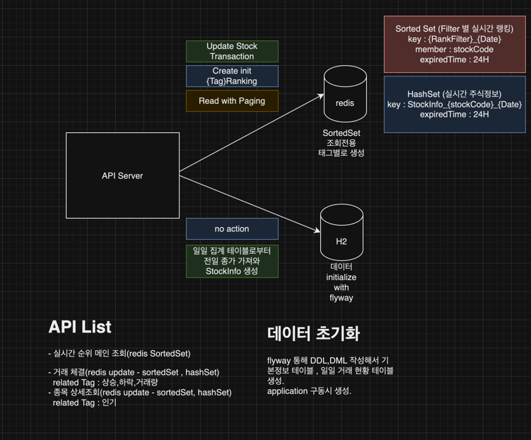

### 기술 스택
Framwork : spring boot 3.1.5 
JDK : openjdk 18 
Build : gradle  
Storage : H2, Redis

### Dependency
spring-data-jpa 
flyway 
openapi 
junit

### Repository 상세
H2 - StockTradeDailyStatics 
종목별 일일 집계 (종목정보, 전일 종가, 당일 종가, 거래량 등) 
Redis - StockInfo 
당일 주식 거래 현황을 실시간으로 관리 , 일일 집계 시점에 StockTradeDailyStatics로부터 생성.

###APIs
- PUT test/{stockCode} : 조회수 증가 api 
주식종목 상세조회 Event 발생 시 조회수 증가에 대한 테스트 api 
- PUT test/{stockCode}/trade : 상승하락률, 거래량 증가 api 
주식거래 완료 Event 발생 시 StockInfo를 최신화하고, 실시간 랭킹을 관리하는 zSet의 score 업데이트 
- GET stocks/ranks : RankFilter 별 실시간 랭킹 페이징 조회 api

###실시간 주식 랭킹 시스템 구성도

### 설계 내용과 이유
- RDB는 데이터적재량이 늘어남에 따라 성능저하 발생 우려가 있기 때문에 Redis SortedSet을 사용해 
일정한 성능을 보장하도록 설계했습니다.
- 주식종목들의 실시간 현황(StockInfo)을 Redis로 관리함에 따라 RDB에 비해 갱신에 유리하고, 동시성 이슈 발생 가능성이 매우 낮습니다.<ㅠㄱ>
실제 비동기요청 1000건을 발생시켜 확인한 결과 기대한 결과값이 갱신되었습니다. 
- RaceConditon이 우려된다면 TransactionOperations를 이용해 한 트랜잭션으로 묶어서 처리한다면 안전하게 처리할 수 있습니다.
- 추가로 고려해야 할 사항은 Redis가 FailOver된 경우입니다. 이 경우를 대비한 회복 전략을 프로젝트에 구성해 놓지는 못하였지만
2가지 방법을 고려해 볼 수 있을 것 같습니다.
  - Redis snapshot 시점부터 kafka를 다시 consume하여 redis를 최신화 할 수 있습니다.
  - Redis snapshot이 존재하지않는 경우를 대비해 StockInfo -> StockTradeDailyStatics 를 특정 주기로 동기화해주는 배치/스케줄러를
    만들고 , 최종 updatedAt시점을 기준으로 kafka를 다시 consume하여 회복할 수 있습니다. 

### 실시간 주식 랭킹 조회 시스템 상세 설명
- 주식 종목 상세조회, 주식거래 완료 Event를 Consume하는 Kafka가 있다고 가정하고 구현했습니다.
- TestInputController 의 api 는 Kafka Consume을 테스트용 api 로 구현한 것입니다.
- Redis에서 주식종목현황정보를 가지고 있는 StockInfo_{stockCode}_{date}는 하루 동안 유지됩니다.
- Redis에서 조회를 위한 SortedSet은 각 rankFilter별로 key가 생성되며 하루 동안 유지됩니다.
- Sorted Set은 O(log(n))의 일정한 성능을 보장해줍니다. 데이터가 늘어날 수록 성능우려가 있는 RDB와 비교해 좋은 선택지 라고 생각합니다.

### 테스트 데이터 세팅을 위한 TestDataGenerator.java 설명
- 주식종목 별 일일 집계 test data 생성은 flyWay로 sampleData 시트의 종목과 현재가를 insert 하였습니다.
- TestDataGenerator.java 는 주식종목 별 일일 집계를 진행하는 Batch 가 있다고 가정 하고 만들었습니다.

